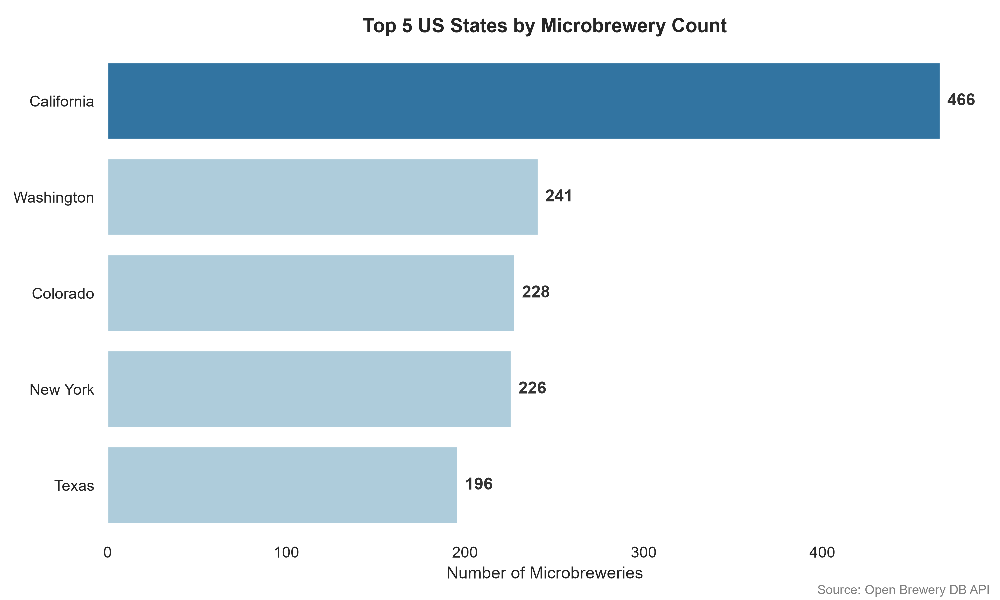
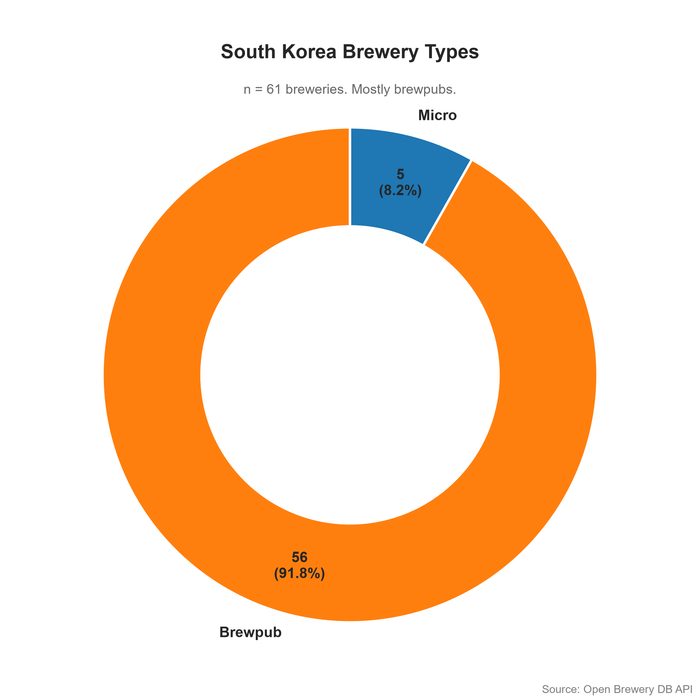
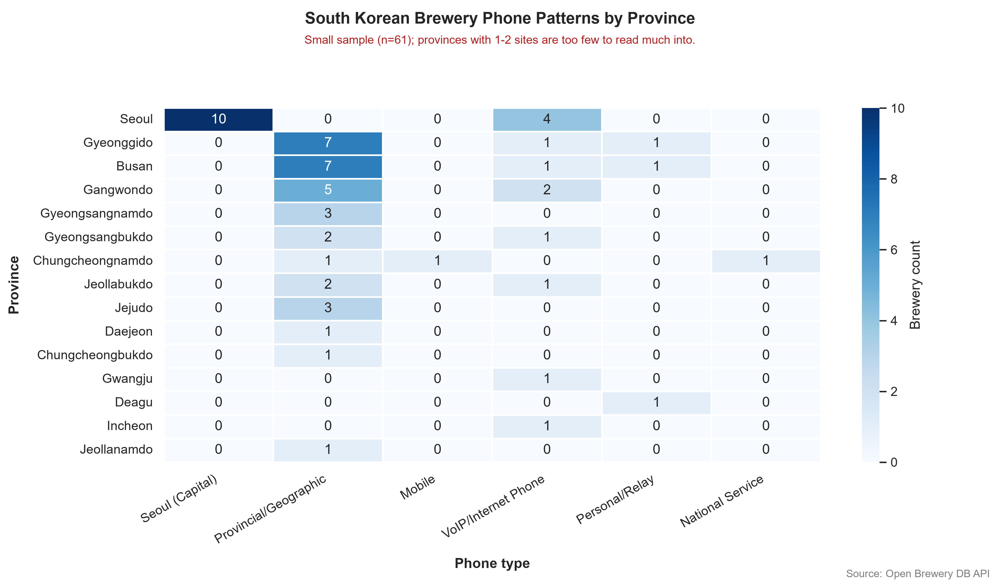

# Brewery ETL Pipeline

An end to end ETL pipeline that pulls the full [Open Brewery DB](https://www.openbrewerydb.org/)
dataset from its public API, cleans it, loads it into a local SQLite database, answers
a set of questions with SQL, and produces three labeled visualizations from the aggregated results.

## The questions and the answers

| # | Question | Answer |
|---|----------|--------|
| 1 | Which US state has the most microbreweries? | **California**, with 466 |
| 2 | Top 5 US states by microbrewery count? | California (466), Washington (241), Colorado (228), New York (226), Texas (196) |
| 3 | How many brewpub breweries are in Incheon, South Korea? | **2** (both of Incheon's two breweries are brewpubs) |
| 4 | (Bonus) Phone number patterns by city in South Korea | Geographic landline prefixes cluster by province (Seoul uses `02`, Busan `051`, and so on), while VoIP (`070`) and mobile (`010`) numbers appear nationwide with no geographic meaning. See the heatmap. |

All four answers are cross-checked against the API's own `/meta` endpoint, so the counts
are verified rather than assumed.

## Visualizations

Three different chart types, each generated from the processed aggregates (not raw API
dumps) and saved to `data/analytics_zone/visualizations/`.

**Top 5 US states by microbrewery count.** A ranked bar chart, ordered and value labelled,
with the leader highlighted.



**South Korea brewery types.** A donut chart showing that the Korean craft scene is
overwhelmingly brewpub-driven, the inverse of the microbrewery heavy United States.



**South Korea phone patterns by province.** A heatmap of phone type against province. The
geographic prefixes line up with their provinces (Seoul with `02`, Busan with `051`), while
VoIP and mobile numbers spread across the country. Cells show raw counts rather than
percentages, so a province with only one brewery cannot look like a dominant trend.



## How it works

The pipeline is five small stages. Each one reads the previous stage's output from the disk 
and writes its own output, so any stage can be re-run on its own without repeating the
work before it.

```
API  ->  extract  ->  transform  ->  load  ->  analytics  ->  visualize
          (raw         (cleaned      (SQLite    (CSV           (PNG
           NDJSON)      NDJSON)       table)     aggregates)    charts)
```

### 1. Extract (`src/extract.py`)

Sweeps every page of the API into a raw NDJSON file, one JSON object per line.

It pulls the whole dataset (about 11,700 breweries) instead of filtering server side for
just the records each question needs. Re-extraction is slow and rate limited, so keeping
everything means the database can answer questions that come up later, and counts always
have a denominator to compare against. Only `id` is required at this stage; every other
field is optional, so a brewery with a missing phone or state still lands, and cleaning is
left to the transform step.

After the sweep it checks the record count against the API's `/meta` total and stops 
if they disagree. A small `raw_breweries.meta.json` sidecar records the timestamp and the
counts (expected, seen, written), which makes the raw layer easy to audit later. Requests
retry with backoff, the page loop has a hard ceiling, and it stops on the first empty page.

### 2. Transform (`src/transform.py`)

Reads the raw NDJSON into pandas and cleans it:

- Strips whitespace and canonicalizes empty strings to nulls, so "missing" means one thing.
- Normalizes `brewery_type` and applies careful title casing to the geographic columns for 
  readable chart labels.
- Derives two phone columns for the South Korea analysis: `phone_prefix` and a
  `phone_type` classification (geographic landline, Seoul, mobile, VoIP, personal/relay,
  national service, and so on), based on the South Korean telephone numbering plan.

The transform is idempotent: the same input always produces the same output.

### 3. Load (`src/load.py`)

Loads the cleaned records into a SQLite table using a **full refresh inside a single
transaction**. Because the extract is always a complete sweep, a full refresh guarantees
the database is an exact mirror of the source on every run, with no stale "ghost" records
left behind by breweries that have since closed.

The refresh is wrapped in one transaction (`BEGIN; DROP; CREATE; INSERT; COMMIT`). SQLite
supports transactional DDL, so if the insert fails partway through, it rolls
back, and the previous table is left untouched.

The table schema is not inferred, which keeps identifier style
columns such as `postal_code` and `phone_prefix` as `TEXT`. This protects leading zeros
(a Boston ZIP code is `02134`, not `2134`, and a Seoul phone prefix is `02`, not `2`).

### 4. Analytics (`src/analytics.py`)

Answers the four questions with plain SQL run through `pandas.read_sql_query`. SQLite does
the aggregation, and pandas is just the delivery vehicle, so we never pull the whole table
into memory. Each aggregate is saved as a CSV into `data/analytics_zone/`, which becomes the input 
for the visualization stage.

### 5. Visualize (`src/visualize.py`)

Reads the CSV aggregates and produces three chart types, each matched to the shape of its
data: a ranked horizontal bar for the top US states (ordered, with values labelled), a
donut for the South Korea brewery type split, and a heatmap of phone type by province
(single hue, annotated with raw counts). All three come from the aggregated CSVs rather
than the raw dump, and carry titles, axis labels, and ordering.

## Project structure

```
brewery/
├── main.py                      # Runs all five stages in order
├── src/
│   ├── extract.py
│   ├── transform.py
│   ├── load.py
│   ├── analytics.py
│   ├── visualize.py
│   └── api.py                   # Optional read-only FastAPI service
├── data/
│   ├── landing_zone/            # Raw NDJSON + metadata sidecar
│   ├── processed_zone/          # Cleaned NDJSON
│   ├── database/                # breweries.db (SQLite)
│   └── analytics_zone/
│       ├── *.csv                # Aggregated results
│       └── visualizations/      # The three PNG charts
├── pyproject.toml
└── README.md
```

## Setup and running

The project targets Python 3.14 and uses [uv](https://docs.astral.sh/uv/) for dependency
management.

### Using uv (recommended)

```bash
uv sync                 # create the environment and install dependencies
uv run python main.py   # run the full pipeline
```

### Using pip and a virtual environment

```bash
python -m venv .venv
source .venv/bin/activate        # on Windows: .venv\Scripts\activate
pip install matplotlib numpy pandas pydantic requests seaborn fastapi "uvicorn[standard]"
python main.py
```

Running `main.py` executes the whole pipeline from a clean slate: it re-fetches the data,
rebuilds the database, recomputes the answers, and regenerates the charts.

You can also run any single stage on its own, for example, while tweaking a chart:

```bash
python -m src.visualize
```

## Tests

The Korean phone parsing and classification are pure functions, so they are covered by unit
tests, including regressions for the cases such as 050 relay numbers and 060
premium-rate numbers sitting inside the 03x-06x range but are not provincial codes, and 1661
service numbers having no trunk zero and must not be mistaken for a missing phone.

```bash
uv run pytest
```

The pipeline also checks itself as it runs: the extract reconciles against `/meta`, the
transform asserts the row count does not change, and the load verifies what landed in the
table.

## API (optional service layer)

A small read-only FastAPI service exposes the processed data and the analysis answers over
HTTP. It opens the SQLite database in read-only mode, so the serving layer can never mutate
the analytical store. Run the pipeline at least once first so the database exists.

```bash
uv run uvicorn src.api:app --reload
# or, with an activated venv:
uvicorn src.api:app --reload
```

Then open http://127.0.0.1:8000/docs for interactive, auto-generated API documentation.

| Method and path | What it returns |
|-----------------|-----------------|
| `GET /health` | Liveness, and whether the database is present |
| `GET /breweries` | Filterable, paginated list (filters: `country`, `state_province`, `brewery_type`, `city`; paging: `limit`, `offset`) |
| `GET /breweries/{id}` | A single brewery, or 404 if not found |
| `GET /analytics/top-microbrewery-states` | Q1 and Q2: US states ranked by microbrewery count |
| `GET /analytics/incheon-brewpubs` | Q3: brewpub count in Incheon |
| `GET /analytics/korea-phone-patterns` | Q4: phone type distribution by province |

All list filters use parameter binding, not string formatting, so the queries are safe
from SQL injection.

## Reproducibility and data integrity

A few things keep the results reproducible:

- The record count is reconciled against the API's `/meta` total at extract time, and again
  after the database load, so a truncated or partial run fails instead of producing wrong numbers.
- The load is idempotent, so running the pipeline twice leaves the database in exactly the
  same state.

Because the pipeline reads from a live API, exact counts can drift by a record or two
between runs as the source database changes. The extract records the timestamp and the
counts it saw in the metadata sidecar, so any such drift is explained rather than mysterious.

## Data quality and known limitations

- **Small sample for South Korea.** There are only about 61 Korean breweries, and some
  provinces have just one or two. The phone pattern charts show raw counts rather than
  percentages precisely so that a single brewery province cannot masquerade as a
  hundred percent trend.
- **Cross language duplicates in place names are not merged.** The source stores some
  regions under more than one spelling (for example the German state appears as both
  "Bavaria" and "Bayern"). Casing typos such as "MIssouri" are handled, but genuine
  translation or abbreviation variants are left as they are in the source. This does not
  affect the US or Incheon answers, which use clean, consistent names.
- **Live source.** The dataset is whatever the API currently returns, so results reflect
  the state of Open Brewery DB at the time of the run.
